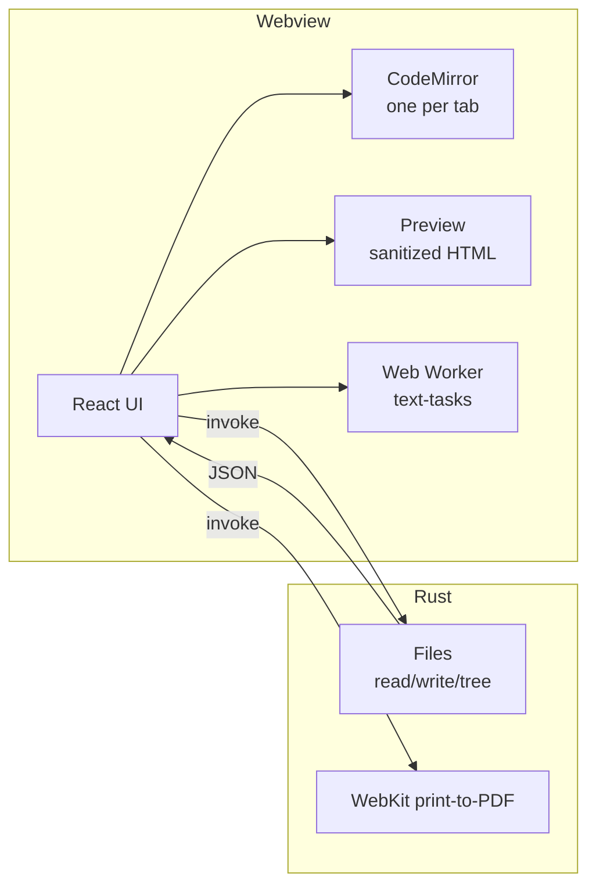

# Architecture

md-view is a Tauri 2 application: a React + CodeMirror frontend (TypeScript, Tailwind v4,
shadcn/ui) and a thin Rust backend for everything that touches the system.



## Modules

| Layer | Files | Responsibility |
| --- | --- | --- |
| State | `src/App.tsx` | Tabs, active document, layout, exports, shortcuts, appearance |
| Chrome | `components/HeaderBar`, `TabBar`, `FormatBar`, `StatusBar`, `Welcome`, `SettingsDialog`, `FileTree`, `WindowResizeHandles` | The interface |
| Editor | `components/Editor.tsx`, `editor/setup.ts`, `editor/format.ts` | CodeMirror configuration and the Markdown commands |
| Preview | `components/Preview.tsx`, `lib/markdown*.ts`, `lib/mdx.ts`, `lib/enhance.ts`, `lib/mermaid.ts`, `lib/highlight.ts` | Render, sanitize and post-process |
| Workers | `lib/text-tasks.ts`, `workers/text-tasks.ts` | Counts and Markdown rendering off the main thread |
| Support | `lib/scroll-sync.ts`, `lib/prefs.ts`, `lib/i18n*.ts`, `lib/limits.ts`, `lib/paths.ts`, `lib/backend.ts` | Sync, preferences, translations, thresholds, paths, Tauri bridge |
| Export | `lib/export.ts` | PDF, HTML, images, SVG, text |
| Backend | `src-tauri/src/lib.rs` | Files, folder tree, recents, printing, opening links |

## State model

```ts
interface Tab {
  id: string;
  doc: { path: string | null; name: string; eol: '\n' | '\r\n'; bom: boolean };
  content: string;       // mirror of the editor (may lag for huge docs)
  dirty: boolean;        // set on the first change, cleared on save
  window?: string;       // huge docs: the first 2,000 lines for the preview
  length?: number;       // huge docs: live length, read from the editor
  mode: ViewMode;        // per tab: edit | split | preview
  cursor: CursorPosition;
}
```

- `tabs` + `activeId` are the whole workspace; the active tab is derived, not stored twice.
- CodeMirror owns the text. The `content` mirror is only updated on every keystroke for
  documents under 500 KB, after a pause up to 8 MB, and never above that
  ([Large documents](/guide/large-documents)).
- Saving, exporting and closing flush the pending state first, so the editor is the source of
  truth.
- Preferences (appearance, editor, preview, explorer, export, language) live in
  `lib/prefs.ts` and are persisted in a single `localStorage` key.

## One editor per tab

`App` renders one `Editor` per tab inside the editor pane; inactive ones are hidden with
`visibility: hidden`, which keeps layout and scroll and needs no re-measuring. That is why
switching tabs costs nothing: there is no state swap and no re-parse.

## Workers on demand

`lib/text-tasks.ts` lazily creates a module worker that handles two message types:

| Task | Payload | Response |
| --- | --- | --- |
| `stats` | Text split into 2 MB chunks aligned to line breaks | `{ words, lines, chars }` |
| `render` | Source + MDX flag | Sanitized-but-not-yet HTML |

The worker is reused while requests keep coming and terminated after 30 s idle (or immediately
when the last tab closes). Because markdown-it and its plugins do not touch the DOM, the same
module (`lib/markdown-core.ts`) runs both in the worker and on the main thread.

## Scroll synchronization

Every block rendered by markdown-it carries `data-line` (its 1-based source line). The sync
maps *lines*, not proportions:

- editor → preview: the first visible line in CodeMirror is located with `lineBlockAtHeight`,
  then the preview is scrolled to the element with that `data-line` (interpolating inside the
  block).
- preview → editor: the topmost visible `data-line` element gives the line, and the editor is
  scrolled with `lineBlockAt` plus the same fractional offset.
- Positions are cached per document and invalidated by a `ResizeObserver` when the preview
  changes height (images loading, Mermaid drawing).
- A time-based lock prevents the echo, and the sync pauses while typing.

## Export pipeline

| Format | Path |
| --- | --- |
| PDF | `invoke('export_pdf')` → WebKitGTK `PrintOperation` with the "Print to File" backend; the page has `@media print` rules that leave only the preview |
| HTML | `buildSelfContainedHtml()` clones the preview, inlines images (through Rust if needed) and embeds the CSS and KaTeX fonts as data URIs |
| PNG / JPG / WebP | `modern-screenshot`, with lazy images forced to load and a canvas scale fitted to a pixel budget |
| SVG | `dom-to-svg`, plus markers/checkboxes added before conversion and KaTeX `@font-face` embedded |
| TXT | `innerText` of the rendered preview |

## Translations

`lib/i18n.ts` holds the dictionaries and a module-level active language; `lib/i18n-react.tsx`
exposes `useI18n()` through a context so memoized components re-render on a language change.
Non-React modules call `t()`.

## Preferences and appearance

`applyAppearance(theme, palette)` sets `data-theme` and `data-palette` on `<html>`; every
color in the app, the preview and CodeMirror is a CSS variable, so a theme change is a single
attribute write (and a Mermaid redraw).
