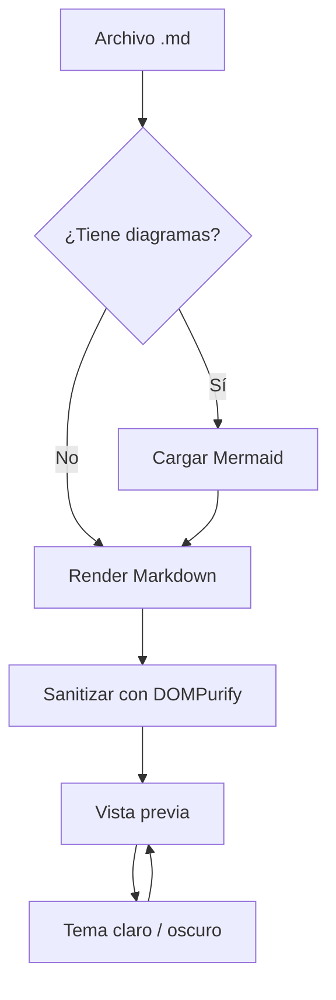
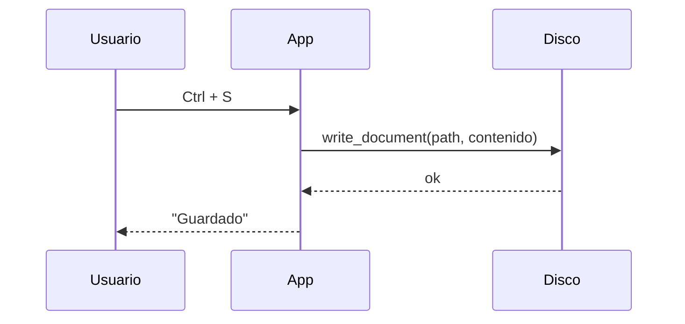
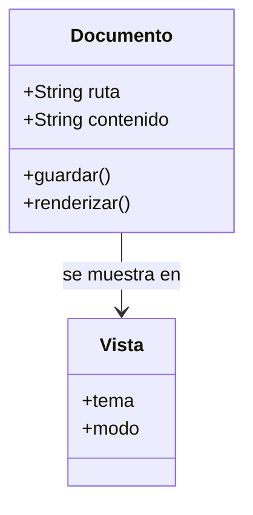
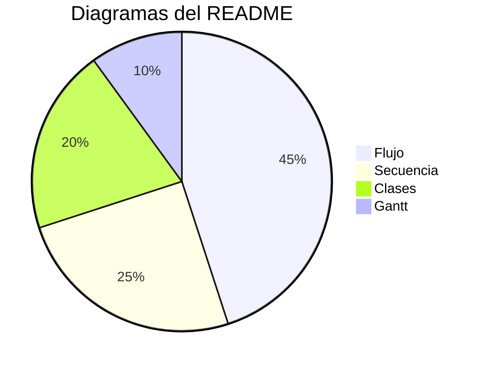

# md-view

Visor y editor de Markdown pensado para leer documentación técnica: **renderiza igual
que GitHub** y agrega lo que un README suele necesitar.

> [!NOTE]
> Este documento es la demo que trae la app. Podés editar el panel de la izquierda y la
> vista previa se actualiza al instante. Para guardarlo, usá *Guardar como*.

---

## 1. Formato de texto

Texto con **negrita**, *cursiva*, ***negrita y cursiva***, ~~tachado~~, `código inline`,
un [enlace externo](https://tauri.app), un enlace roto a un archivo local
(`./no-existe.md`) y una URL suelta autodetectada: https://github.com/markdown-it/markdown-it

También hay abreviaturas en emoji :rocket: :sparkles:, teclas como <kbd>Ctrl</kbd> +
<kbd>Shift</kbd> + <kbd>P</kbd> y bloques plegables:

<details>
<summary>Ver detalles del motor de render</summary>

markdown-it + KaTeX + Mermaid + highlight.js, y el HTML final pasa por DOMPurify.

</details>

## 2. Listas

1. Listas ordenadas
2. Con sublistas anidadas
   - Un nivel más
     - Y otro más
3. Mezclando viñetas

- [x] Tablas GFM
- [x] Listas de tareas
- [x] Fórmulas LaTeX
- [ ] Modo colaborativo (no está en el plan :wink:)

## 3. Tablas

| Característica | Estado | Notas |
| :--- | :---: | ---: |
| Tablas GFM | ✅ | alineación por columnas |
| Fórmulas | ✅ | `$inline$` y bloque |
| Mermaid | ✅ | se redibuja al cambiar el tema |
| SVG animado | ✅ | dentro de `` |
| Código | ✅ | 30+ lenguajes |

| Izquierda | Centro | Derecha |
| :-------- | :----: | ------: |
| `a` | `bb` | `333` |
| texto largo que ocupa espacio | x | 1.234 |

## 4. Alertas

> [!NOTE]
> Información útil para tener en cuenta mientras se lee.

> [!TIP]
> Atajo: <kbd>Ctrl</kbd> + <kbd>2</kbd> muestra editor y vista previa a la vez.

> [!IMPORTANT]
> El archivo se guarda respetando el fin de línea original (LF o CRLF).

> [!WARNING]
> Un documento Markdown puede contener HTML; acá se sanitiza antes de mostrarlo.

> [!CAUTION]
> Si cerrás la ventana con cambios sin guardar, te vamos a preguntar.

> Una cita normal, sin marcador, para comparar el estilo.

## 5. Código

```ts
type Estado = 'borrador' | 'listo';

interface Documento {
  ruta: string;
  contenido: string;
  fecha: Date;
}

export async function guardar(doc: Documento): Promise<Estado> {
  if (!doc.contenido.trim()) throw new Error('documento vacío');
  await fs.writeFile(doc.ruta, doc.contenido, 'utf8');
  return 'listo';
}
```

```python
from dataclasses import dataclass

@dataclass
class Documento:
    ruta: str
    contenido: str

    def palabras(self) -> int:
        return len(self.contenido.split())
```

```bash
# Instalar dependencias del sistema y arrancar en modo desarrollo
sudo apt install libwebkit2gtk-4.1-dev build-essential
pnpm install && pnpm app
```

```json
{ "productName": "md-view", "version": "0.1.0", "identifier": "com.mdview.desktop" }
```

```diff
- temas: solo claro
+ temas: claro y oscuro
+ sinais de scroll sincronizados
```

```
Bloque sin lenguaje: se muestra como texto plano.
```

## 6. Fórmulas (LaTeX / KaTeX)

En línea: la energía en reposo es $E = mc^2$ y el área de un círculo es $A = \pi r^2$.

En bloque:

$$
\int_{0}^{\infty} e^{-x^2}\,dx = \frac{\sqrt{\pi}}{2}
$$

Sistema de ecuaciones:

$$
\begin{aligned}
\nabla \cdot \mathbf{E} &= \frac{\rho}{\varepsilon_0} \\
\nabla \times \mathbf{B} &= \mu_0 \mathbf{J} + \mu_0\varepsilon_0 \frac{\partial \mathbf{E}}{\partial t}
\end{aligned}
$$

Matriz:

$$
\mathbf{A} =
\begin{pmatrix}
a_{11} & a_{12} & a_{13} \\
a_{21} & a_{22} & a_{23}
\end{pmatrix}
\qquad
\det \mathbf{A} = \sum_{\sigma \in S_n} \operatorname{sgn}(\sigma)
\prod_{i=1}^{n} a_{i,\sigma(i)}
$$

También se acepta un bloque con fence:

```math
f(x) = \sum_{n=0}^{\infty} \frac{f^{(n)}(a)}{n!}(x-a)^n
```

## 7. Diagramas Mermaid









## 8. Imágenes y SVG

Un SVG animado con animaciones SMIL, referenciado como imagen normal:


O incrustado con HTML para controlar el tamaño:


Los `.gif`, `.webp`, `.avif` y también `<video>` funcionan igual:

```html

```

> En un documento real, las rutas relativas (`./img/x.png`, `../comun/logo.svg`) se
> resuelven contra la carpeta del archivo abierto.

## 9. Notas al pie

El render respeta el fin de línea del archivo[^eol] y el BOM si lo tenía[^bom].

[^eol]: Se guarda tal como estaba: LF en Linux/macOS, CRLF en Windows.
[^bom]: El marcador de orden de bytes de UTF-8, para no romper archivos de otras herramientas.

---

Hecho con [Tauri](https://tauri.app), [markdown-it](https://github.com/markdown-it/markdown-it),
[KaTeX](https://katex.org) y [Mermaid](https://mermaid.js.org).
