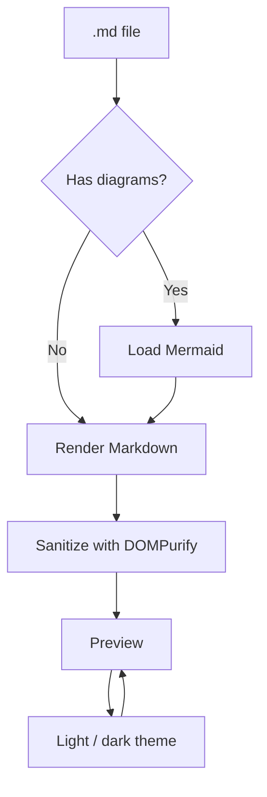
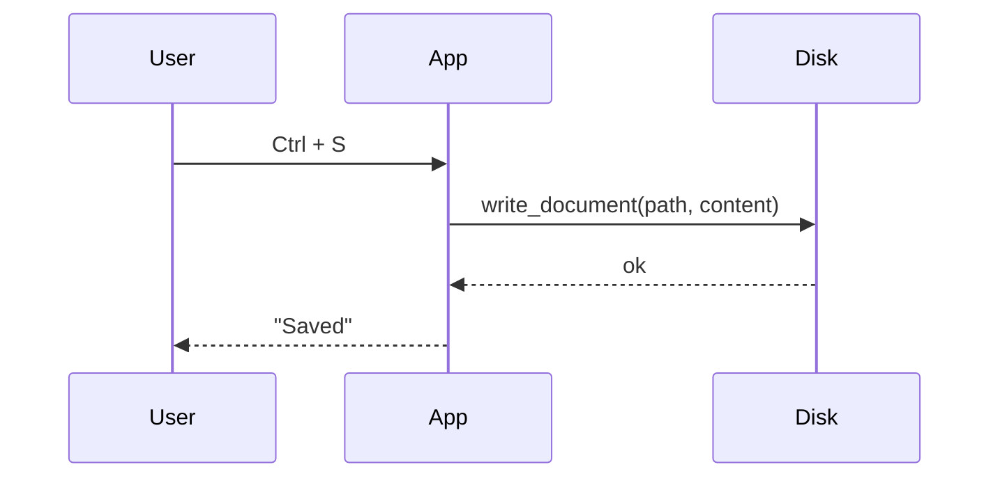
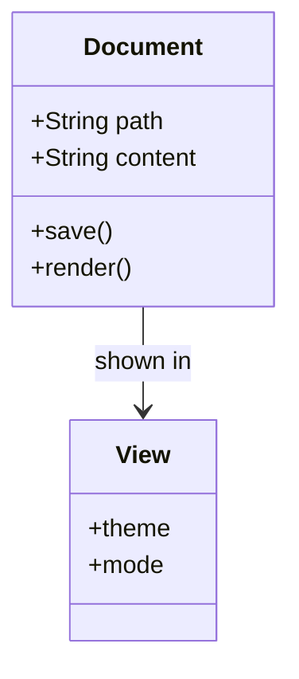
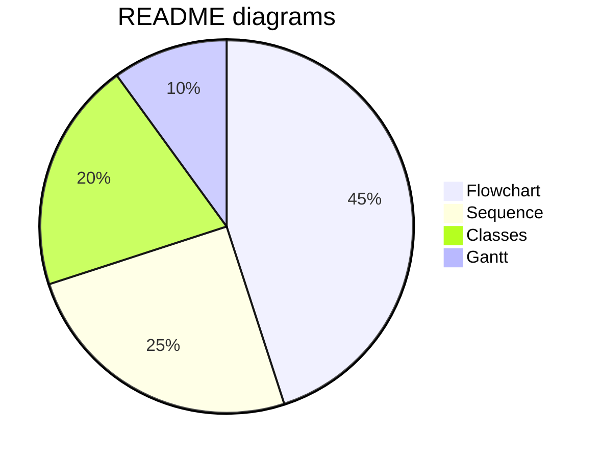

# md-view

A Markdown viewer and editor built for reading technical documentation: it **renders the
same as GitHub** and adds what a README usually needs.

> [!NOTE]
> This is the demo document that ships with the app. Edit the left pane and the preview
> updates instantly. To keep your changes, use *Save as*.

---

## 1. Text formatting

Text with **bold**, *italic*, ***bold and italic***, ~~strikethrough~~, `inline code`,
an [external link](https://tauri.app), a broken link to a local file (`./does-not-exist.md`)
and a bare autodetected URL: https://github.com/markdown-it/markdown-it

There are also emoji shortcodes :rocket: :sparkles:, keys like <kbd>Ctrl</kbd> +
<kbd>Shift</kbd> + <kbd>P</kbd>, and collapsible blocks:

<details>
<summary>Show rendering engine details</summary>

markdown-it + KaTeX + Mermaid + highlight.js, and the final HTML goes through DOMPurify.

</details>

## 2. Lists

1. Ordered lists
2. With nested sublists
   - One level deeper
     - And another one
3. Mixing bullets

- [x] GFM tables
- [x] Task lists
- [x] LaTeX formulas
- [ ] Collaborative mode (not on the roadmap :wink:)

## 3. Tables

| Feature | Status | Notes |
| :--- | :---: | ---: |
| GFM tables | ✅ | per-column alignment |
| Formulas | ✅ | `$inline$` and blocks |
| Mermaid | ✅ | redraws on theme change |
| Animated SVG | ✅ | inside `` |
| Code | ✅ | 30+ languages |

| Left | Center | Right |
| :-------- | :----: | ------: |
| `a` | `bb` | `333` |
| a long piece of text | x | 1,234 |

## 4. Alerts

> [!NOTE]
> Useful information to keep in mind while reading.

> [!TIP]
> Shortcut: <kbd>Ctrl</kbd> + <kbd>2</kbd> shows the editor and the preview at once.

> [!IMPORTANT]
> Files are saved respecting the original line ending (LF or CRLF).

> [!WARNING]
> A Markdown document can contain HTML; here it is sanitized before rendering.

> [!CAUTION]
> If you close the window with unsaved changes, we will ask you first.

> A regular quote, without a marker, to compare the style.

## 5. Code

```ts
type State = 'draft' | 'ready';

interface Document {
  path: string;
  content: string;
  updatedAt: Date;
}

export async function save(doc: Document): Promise<State> {
  if (!doc.content.trim()) throw new Error('empty document');
  await fs.writeFile(doc.path, doc.content, 'utf8');
  return 'ready';
}
```

```python
from dataclasses import dataclass

@dataclass
class Document:
    path: str
    content: str

    def words(self) -> int:
        return len(self.content.split())
```

```bash
# Install the system dependencies and start in development mode
sudo apt install libwebkit2gtk-4.1-dev build-essential
pnpm install && pnpm app
```

```json
{ "productName": "md-view", "version": "0.1.0", "identifier": "com.mdview.desktop" }
```

```diff
- themes: light only
+ themes: light and dark
+ synchronized scroll panes
```

```
Block without a language: shown as plain text.
```

## 6. Formulas (LaTeX / KaTeX)

Inline: the rest energy is $E = mc^2$ and the area of a circle is $A = \pi r^2$.

As a block:

$$
\int_{0}^{\infty} e^{-x^2}\,dx = \frac{\sqrt{\pi}}{2}
$$

System of equations:

$$
\begin{aligned}
\nabla \cdot \mathbf{E} &= \frac{\rho}{\varepsilon_0} \\
\nabla \times \mathbf{B} &= \mu_0 \mathbf{J} + \mu_0\varepsilon_0 \frac{\partial \mathbf{E}}{\partial t}
\end{aligned}
$$

Matrix:

$$
\mathbf{A} =
\begin{pmatrix}
a_{11} & a_{12} & a_{13} \\
a_{21} & a_{22} & a_{23}
\end{pmatrix}
\qquad
\det \mathbf{A} = \sum_{\sigma \in S_n} \operatorname{sgn}(\sigma)
\prod_{i=1}^{n} a_{i,\sigma(i)}
$$

A fenced block works too:

```math
f(x) = \sum_{n=0}^{\infty} \frac{f^{(n)}(a)}{n!}(x-a)^n
```

## 7. Mermaid diagrams









## 8. Images and SVG

An animated SVG with SMIL animations, referenced as a regular image:


Or embedded with HTML to control the size:


`.gif`, `.webp`, `.avif` and `<video>` work the same way:

```html

```

> In a real document, relative paths (`./img/x.png`, `../shared/logo.svg`) are resolved
> against the folder of the file you opened.

## 9. Footnotes

The render respects the file line ending[^eol] and the BOM if it had one[^bom].

[^eol]: Saved exactly as it was: LF on Linux/macOS, CRLF on Windows.
[^bom]: The UTF-8 byte order mark, kept so other tools don't break.

---

Built with [Tauri](https://tauri.app), [markdown-it](https://github.com/markdown-it/markdown-it),
[KaTeX](https://katex.org) and [Mermaid](https://mermaid.js.org).
